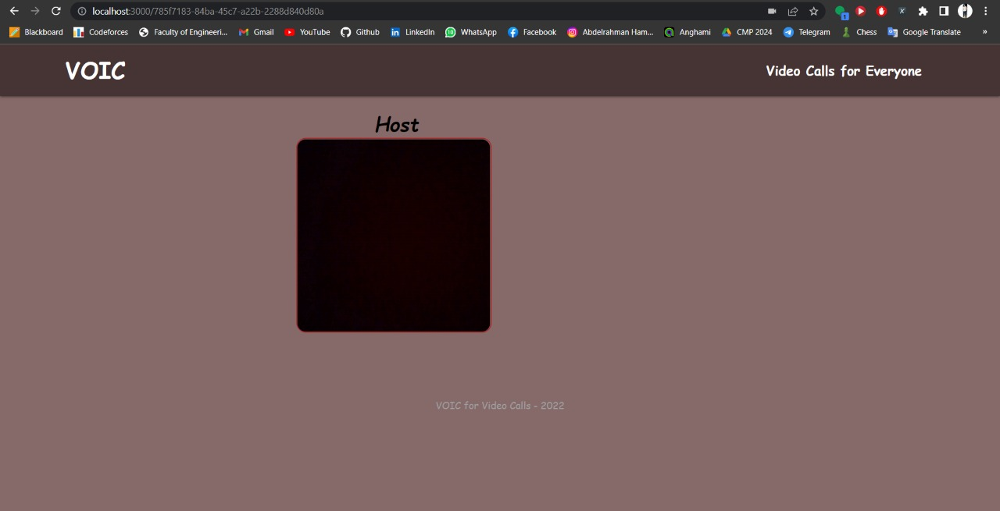
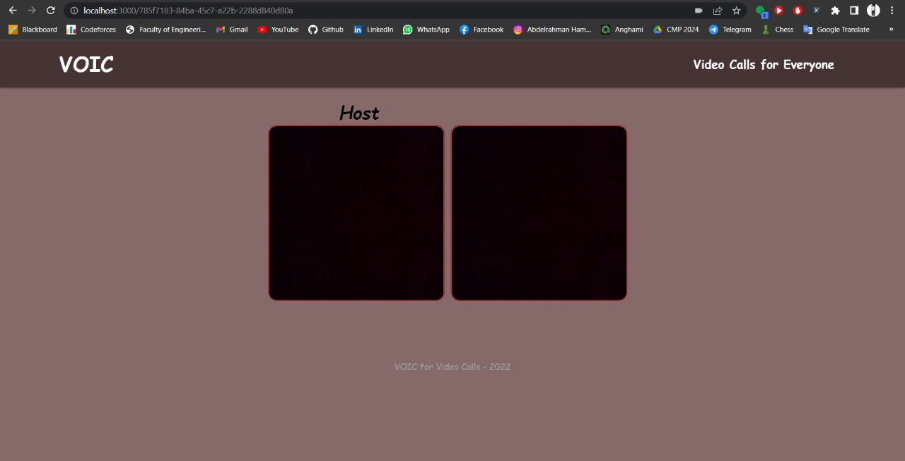
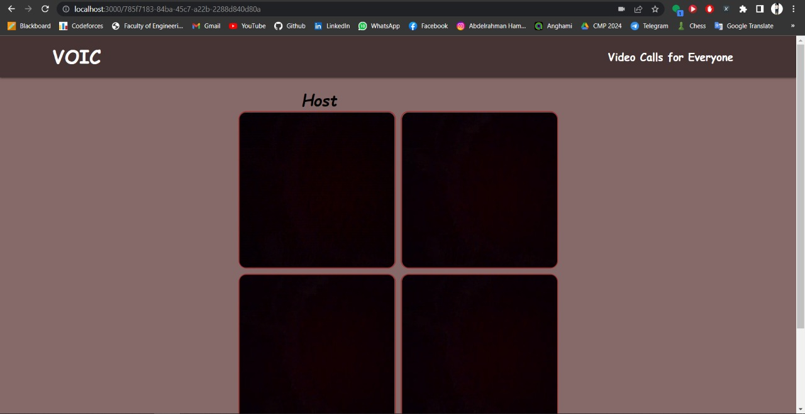

# VOIC

## 📝 Table of Contents

- [About](#about)
- [Approach](#approach)
- [Technology](#tech)
- [Live Demo](#demo)
- [Screenshots](#Screenshots)
- [Contributors](#Contributors)
- [License](#license)

## 📙 About <a name = "about"></a>

- VOIC is a video call app between 2 or more peers which depends fully on internet connection and camera/audio permissions.

## 🔍 Approach <a name = "approach"></a>

- A connection is established between the user joined and the socket using **socket-io** which interacts with the **express** server. A random room is automatically generated using **uuid**. The application runs with events which we set on the socket such as user-connected, user-disconnected, join-room, etc.. The user-connected and the join-room event are emitted whenever a user connects to the webpage. We also use **PeerJS** to create the connection between users with dynamic IDs.

## 💻 Built Using <a name = "tech"></a>

- **HTML**
- **CSS**
- **JavaScript**
- **ExpressJS**
- **Socket-io**
- **PeerJS**

<hr>
<br>

<li>Clone the repository.

<br>

```
git clone https://github.com/abdelrahman0123/VOIC
```

<li>Initialize NPM.

<br>

```
npm init -y
```

<li>Download Packages.

<br>

```
npm i express ejs socket.io uuid
```

<li>Install nodemon.

<br>

```
npm i --save-dev nodemon
```

<li>Start the nodemon server.

<br>

```
npm run devStart
```

<li>Open a new terminal and install PeerJS.

<br>

```
npm i -g peer
```

<li>Start the PeerJS server.

<br>

```
peerjs --port 3001
```

<br>

**Go to localhost:3000**<br>
**Copy & paste url elsewhere for a new user to join**

<hr>
<br>

## 🎥 Live Demo <a name = "demo"></a>

<a href="https://drive.google.com/file/d/1SG5ZzVw_bEe_OWayIpKGMgeKjTX1OhBT/view?usp=sharing" >Here</a>

## 📷 Screenshots <a name = "Screenshots"></a>

**_Black Screen is a video._**

<div align="center">
   </a>
   </a>
   </a>
   <hr>
</div>

## Contributors <a name = "Contributors"></a>

<table>
  <tr>
    <td align="center">
    <a href="https://github.com/abdelrahman0123" target="_blank">
    
    <br />
    <sub><b>Abdelrahman Hamdy</b></sub></a>
    </td>
  </tr>
 </table>

## License <a name = "license"></a>

> This software is licensed under MIT License, See [License](https://github.com/abdelrahman0123/VOIC/blob/main/LICENSE) for more information ©abdelrahman0123.
